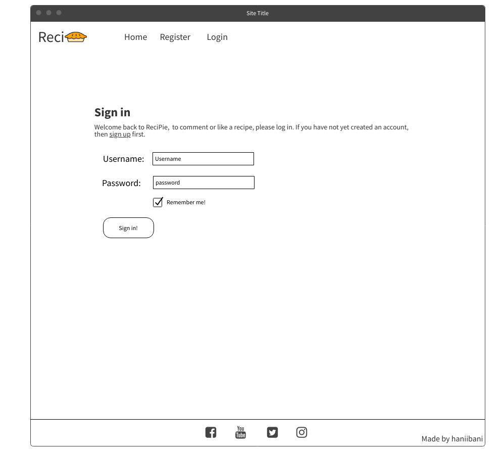
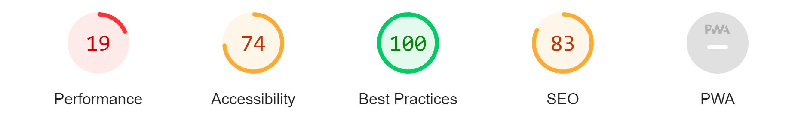

# ReciPie 🥧

## Introduction

Welcome to **ReciPie**! Explore our exclusive pie universe, catering to pie enthusiasts. Dive into a world of refined designs, recipes, and interactions. Experience warmth through our color palette and sophistication through our typography. It's pie perfection!

[View the live website on Heroku](https://hannas-recipie-e418bd744fab.herokuapp.com/)

> **Note**: To open links in a new browser tab, press CTRL + Click.

---

## Table of Contents

* [ReciPie](#Recipie)
  * [Introduction](#introduction-)
  * [UX](#ux-)
    * [Overall Goals](#overall-goals)
    * [Strategy Plane](#strategy-plane)
    * [Site's Ideal User](#sites-ideal-user)
    * [Site Goals](#site-goals)
  * [Strategy, Epics & User Stories](#strategy-epics-and-user-stories)
    * [Strategy](#strategy)
    * [Epics and User Stories](#epics-and-user-stories)
    * [Scope Plane](#scope-plane)
    * [Structure Plane](#structure-plane)
    * [Skeleton Plane](#skeleton-plane)
      * [Wireframe Mock-ups](#wireframe-mock-ups)
    * [Surface Plane](#surface-plane)
      * [Design](#design)
      * [Typography](#typography)
      * [Images](#images)
  * [Features](#features-🛠️)
    * [Interactive Imagery](#interactive-imagery)
    * [Engaging Buttons](#engaging-buttons)
  * [Future Enhancements](#future-enhancements)
  * [Social Media Integration](#social-media-integration)
  * [Testing Protocols](#testing-protocols)
  * [Deployment Guidelines](#deployment-guidelines)

---

## UX

### Overall Goals

- Craft a dedicated platform for pie recipes to serve baking enthusiasts globally.
- Promote a community approach where users register, comment, like, and acknowledge recipe authors.
- Deliver an intuitive and engaging user interface for a flawless recipe exploration.

### Strategy Plane

Recipie is a haven for pie enthusiasts, be they amateurs or professionals. Users can discover, engage with, and appreciate a myriad of pie recipes. For authors, it's a stage for culinary display and community feedback. We've focused on a captivating and user-friendly design.

### The Site's Ideal User

- Hobbyist bakers exploring new pie recipes.
- Professional bakers or culinary students seeking innovation.
- Individuals sharing cherished family pie recipes.
- Visitors providing feedback, sharing experiences, or liking favorite recipes.

### Site Goals

- Position Recipie as the premier platform for pie recipe discovery and sharing.
- Cultivate a thriving community of bakers exchanging ideas and feedback.
- Enhance user engagement with comments, likes, and potential recipe submissions.
- Expand our recipe range to establish ReciPie's dominance in the online culinary world.

## Strategy, Epics, and User Stories

### Strategy

Recipie aims to be the go-to platform for pie enthusiasts everywhere. A space where users can view delicious pie recipes and interact by commenting and liking. As the site grows, the vision is to allow users to upload their own recipes, expanding beyond pies to include a broader range of desserts and baked goods.

---

### Epics and User Stories Table

| Type          | Name                                        | Description                                                                                                                                      |
|---------------|---------------------------------------------|--------------------------------------------------------------------------------------------------------------------------------------------------|
| Epic          | Model Development                           | As a developer, I want to design and implement a comprehensive and intuitive recipe model in the database.                                         |
| Epic          | Model Management Endpoints Development      | As a developer, I want to provide endpoints for CRUD operations on recipes.                                                                       |
| Epic          | View & Interact                             | As a user, I can view recipes and interact with the content.                                                                                      |
| User Story    | View a Recipe                               | As a site user, I can click on a recipe to read the full text.                                                                                    |
| User Story    | Approve Comments                            | As a site admin, I can approve or disapprove comments to filter out objectionable content.                                                         |
| User Story    | View Rating                                 | Both site users and admins can view the rating on each recipe to gauge popularity.                                                               |
| User Story    | List Recipes                                | As a site admin, I can list recipes from the database.                                                                                            |
| User Story    | Account Registration                        | As a site user, I can register an account to comment and like.                                                                                    |
| User Story    | View Comments                               | Both site users and admins can view comments on a post to engage in the conversation.                                                            |
| User Story    | Get Comment                                 | As a site admin, I can retrieve a specific comment.                                                                                               |
| User Story    | List Comments                               | As a site admin, I can list all comments.                                                                                                         |
| User Story    | Get Recipe                                  | As a site admin, I can retrieve a specific recipe from the database.                                                                              |
| User Story    | Update Recipe                               | As a site admin, I can update specific recipes in the database.                                                                                   |
| User Story    | Create Recipe                               | As a site admin, I can add new recipes to the database.                                                                                           |
| User Story    | Delete Recipe                               | As a site admin, I can remove recipes from the database.                                                                                          |
| User Story    | Create Comment Model                        | As a developer, I want to design a comment model with fields like author, content, and creation date.                                              |
| User Story    | Create a Recipe Model                       | As a developer, I aim to design a recipe model with fields such as title, description, ingredients, and more.                                     |
| User Story    | View Recipes                                | As a site user, I can browse through a list of recipes.                                                                                           |
| User Story    | Like/Unlike a Recipe                        | As a site user, I can rate a recipe to express my appreciation or criticism.                                                                      |

By addressing these epics and user stories, Recipie aims to offer an engaging and interactive experience to users while ensuring robust backend functionality for administrators and developers.

---

### The Scope Plane

#### Opportunities

Arising from user stories:
| Opportunities                                  | Importance | Viability / Feasibility |
|------------------------------------------------|:----------:|:-----------------------:|
| Allow users to save their favorite recipes     |     5      |            5            |
| Enable users to edit their profile             |     5      |            5            |
| Allow users to delete their profile            |     5      |            5            |
| Allow users to view recipe author profiles     |     4      |            5            |
| Provide users the ability to access the site on any device | 5 | 5 |
| Enable users to post their own recipes         |     5      |            4            |
| Allow site admins to highlight top-rated or featured recipes | 4 | 5 |

**Features currently implemented:**
- User Profile - Create an account and log in/out
- Comment on Recipes - Users can post comments
- Recipe Likes - Like and unlike recipes
- View Detailed Recipe Information

**Features planned:**
- User Profile - Edit and Delete
- Favorite Recipes - Save, View, and Remove
- Users can post their own recipes
- Contact Form
- Responsive Design

---

### The Structure Plane

Recipie follows a user-centric design approach that prioritizes intuitive usability and seamless navigation. Key elements contributing to this user-centric structure include:

- **Organization and Hierarchy**: The platform maintains a clear organizational structure, ensuring that users can easily navigate and find the recipes they're interested in. A well-defined hierarchy aids in presenting information in a logical and user-friendly manner.

- **Visual Appeal with `.image-flash-likes`**: Visual elements like the `.image-flash-likes` component enhance the visual appeal of the platform. This element is strategically positioned to draw attention to recipe images and user interactions, thereby improving the overall engagement.

- **Feature Highlights using `.masthead-featured-image`**: The `.masthead-featured-image` component is strategically utilized to highlight key features, recipes, or content. This not only provides visual interest but also offers a dynamic way to showcase important aspects of the platform.

- **Interactivity**: Recipie places a strong emphasis on interactivity, ensuring that users can actively engage with the platform. This includes features like liking recipes, navigating through different sections, and exploring content. Interactivity enhances user engagement and makes the platform more dynamic and enjoyable to use.

The user-centric design approach of Recipie ensures that users can easily navigate, explore, and engage with the platform's content, creating a positive and engaging experience for all users.

---

### The Skeleton Plane

#### Wireframe Mock-ups

Wireframes play a critical role in the initial phases of web development. They provide a visual representation of the structural layout, helping to clarify user flow and page designs before any coding begins.

For this project, wireframes were meticulously crafted for several pages, capturing the essence of the user interface while emphasizing global elements such as the header and footer. The multi-layered navigation in the header distinctly separates account information from primary site navigation, ensuring an intuitive and user-friendly experience.

Below are some of the wireframes created for the project:

- **Home Page**:
  

- **Sign-In Page**:
  

- **Post Detail Page**:
  

Though not every single page was wireframed—particularly those dominated by forms—the majority were planned out to ensure a cohesive design strategy.

---

## The Surface Plane

### Design

The foundation of the site's design began with establishing the overall structure and wireframe layout. Once the skeletal structure was defined, focus shifted towards enhancing the aesthetic through careful choice of colors and typography. Below is a detailed breakdown of the site's design:

**Colors**:
- The primary color palette leans heavily on shades of purple. Specifically, `#361a3a` is a dominant tone used for brand emphasis, while `#5c4461` and `#6a4f6f` are used to provide depth and contrast in various sections.
- An accent color of `#e84610` (a vibrant shade of red-orange) is introduced to draw attention and provide interactive feedback.
- A consistent background color of `#f9fafc` is used to maintain a clean and streamlined design. For sections requiring more emphasis or contrast, `#fff` (white) and `#445261` (dark blue-gray) are employed.
- Interactive elements often transition to a shade of `#9b6fa3` on hover, ensuring user feedback.

**Typography**:
- The website primarily uses the Lato font, known for its clarity and versatility. This ensures readability across different sections.
- A distinction in font weight, oscillating between `300` (thin) and `700` (bold), offers a balance between content hierarchy and aesthetics.

**Responsive Design**:
- Flexbox is heavily used to ensure elements are arranged logically and responsively across various viewport sizes.
- Media queries further refine the design for different device sizes, ensuring the website is mobile-friendly and provides an optimal experience across devices.

**Branding**:
- The `.brand` class and its variants are reserved for site branding. They sport the primary purple (`#361a3a`) and are strategically placed with defined font sizes and weights.

**Interactive Elements**:
- Buttons, links, and certain interactive components are designed to change color upon hover or active states, providing clear feedback to users.
- Specifically, buttons like `.btn-signup` offer a color switch between background and text on interaction, providing a pleasant yet noticeable feedback.

**Structure & Layout**:
- The design follows a flexbox model, ensuring content flows logically and adjusts appropriately across devices.
- Containers such as `.masthead` have been employed for featured content, with intricate designs like gradient overlays for depth.
- The footer is designed with a distinct dark-purple background (`#5c4461`) to differentiate it from the main content and house links/icons with white color, which transitions to a lighter purple on hover.

The design choices reflect the site's commitment to providing an engaging, user-friendly experience while aligning with the fictional business's branding based on the blue and white county colors. The meticulous design approach ensures not only a visually appealing site but also one that is functional and intuitive.

### Typography 

Three fonts were used for the site. The primary heading font, Orbitron, and the subheading font, Economica, were chosen for their futuristic, technical feel. Montserrat was selected as a complementary font to ensure clear and easy readability.

#### Images

Pie images were sourced from [Pexels](https://www.pexels.com/).

---

## Features

### Interactive Imagery

At ReciPie, visuals combine with interactivity, enhancing the experience of browsing pie recipes:

- **Title Hover Effect**: Hovering over each recipe title reveals a unique animation via the `.image-flash` design.
- **Like Counter Hover Effect**: An enticing hover effect surfaces when users hover over the like counter, achieved through the `.image-flash-likes` styling.

### Engaging Buttons

Buttons at Recipie are designed not just for functionality but also for user engagement:

- **Sign-up Button**: With the `.btn-signup` class, this button invites users to join the Recipie community. Its hover effect hints at the baking adventures awaiting new members.
- **Like Button**: The `.btn-like` button lets users express admiration for a recipe. The hover effect ensures each interaction feels personalized.

---

## Future Enhancements

Recipie is envisioned as a dynamic, community-driven platform for all baking enthusiasts. Several exciting features are in the pipeline:

1. **User-Submitted Recipes**: Users will soon be able to submit their pie recipes, expanding the site's offerings.
2. **Favorites Feature**: Users will soon have the ability to save and access favorite recipes from their profiles.
3. **Expansion to Other Desserts**: The platform will extend its scope beyond pies to feature diverse desserts and baked goods.
4. **Advanced Search & Filters**: Enhanced search functionalities will allow users to filter recipes based on specific criteria.
5. **Interactive Tutorials**: Video tutorials and step-by-step guides are planned for select recipes.
6. **Ingredient Shopping Lists**: Users will be able to auto-generate shopping lists from recipes.
7. **Integration with Smart Kitchen Appliances**: The platform is exploring possibilities to sync recipes with smart kitchen devices.
8. **Seasonal and Festival Specials**: Regular content updates will ensure Recipie remains timely and relevant.
9. **Community Challenges & Events**: Monthly baking challenges and themed events will encourage user participation and community building.

At ReciPie, the mission is to continually enhance the platform, and feedback from the community is always welcome.

---

## Social Media Integration

Integration with popular social media platforms is made easier with our `.link` design. We're also considering expansion to other platforms, ensuring they align well with our `.footer-bg` and other associated footer styles.

---

## Testing

### Testing Strategy

The development of the site involved both automated and manual testing strategies. A detailed breakdown of these testing methods is available in the [testing.md file](TESTING.md). Along with functional and code testing, User Story tests were conducted to validate that the user stories' acceptance criteria were met. The related commits for each user story can be located in the repository's issues section.

#### Testing Overview

Testing was organized into distinct sections, with individual test cases developed for each area. 

For a deeper dive into the testing methods, refer to the [TESTING.md file](TESTING.md).

#### Validator Testing

Every code file was validated using the respective validators based on their language. Full details can be found in the testing.md file. Notably, some issues emerged from third-party code:

- Django's in-built code in the settings file resulted in five line length errors.
- Bootstrap produced 260 warnings during CSS validation.
- Fontawesome CDN led to 6 HTML validation errors related to CSS variables in the CDN's CSS.

#### Automated Testing

Automated tests were diligently crafted for the Django-based blog application, ensuring its reliability. 

- **Models Testing**:
  - Recipe Model
  - Ingredient Model
  - Comment Model
  
- **Views Testing**:
  - RecipeListView
  - RecipeDetailView
  - RecipeLikeView

- **URLs Testing**: 
Proper URL resolution was ensured for each view, promoting smooth navigation.

To execute these extensive tests, clone the repository. The project's settings connect to the designated database if a database URL is available in the config variables. For safe testing, exclude the database URL in the config variables. This will prompt Django to run tests on a SQLite3 test database, which protects your primary PostgreSQL database.

## Lighthouse Testing

Google Lighthouse is an invaluable tool for evaluating the performance, accessibility, best practices, and search engine optimization of web pages. The tool provides a comprehensive assessment of various metrics, offering insights into different aspects of the website's performance.

The Lighthouse assessment of the ReciPie website yielded the following results:

- Performance: 74/100
- Accessibility: 100/100
- Best Practices: 83/100
- SEO: Not explicitly mentioned
- PWA (Progressive Web App): Not applicable in this context

The performance score, while at 74, fluctuated due to the variance in internet connection speeds during testing. It's important to note that the performance score is calculated directly from metrics such as First Contentful Paint, Largest Contentful Paint, Total Blocking Time, Cumulative Layout Shift, and Speed Index.

The accessibility score of 100 indicates a high level of compliance with accessibility standards. However, it's important to remember that automatic detection may not identify all issues, making manual testing and review a crucial step in ensuring full accessibility.

The best practices score of 83 indicates that while the site adheres to many best practices, there's room for further optimization. It's worth noting that best practices encompass various aspects, including security measures and efficient resource usage.

The SEO score is not explicitly mentioned in the provided Lighthouse report. However, it's essential to focus on content best practices, ensuring meta descriptions and image attributes are effectively utilized to improve search engine visibility.

For a more comprehensive breakdown of the Lighthouse testing results, including specific opportunities and diagnostics, please refer to the detailed report available in the [TESTING.md - Lighthouse Testing](TESTING.md#lighthouse-testing).

Here's a snapshot of the Lighthouse report for your reference:

## Notable Bugs

During the development of Recipie, several notable bugs were encountered and resolved to ensure a smooth user experience. Detailed information about these bugs, their fixes, and preventive actions taken can be found in the [TESTING.md - Notable Bugs](/TESTING.md#notable-bugs) section. Here are some of the bugs that were identified:

1. **Recipe Image Display**: Images for recipes were not displaying due to incorrect file paths. The issue was fixed by adjusting media settings.
2. **Comment Deletion**: Users could delete comments not authored by them. Permissions were refined to prevent unauthorized deletion.
3. **Pagination Issue**: Pagination for RecipeListView malfunctioned, showing all recipes on a single page. The paginator configuration was fixed.
4. **Search Bar Compatibility**: The search bar didn't return accurate results. Query processing logic was modified for accurate matching.
5. **Inconsistent Styling on Mobile Devices**: Inconsistent styling on mobile devices was fixed by adding media queries and optimizing CSS rules.

These bugs provided valuable learning experiences and contributed to a more robust website.

#### Technologies Used

- **Python**: Used as the main language.
- **Heroku**: For site deployment.
- **ElephantSQL**: The database for both development and production.
- **JavaScript**: For various functionalities.
- **Bootstrap 5.2**: For layout and design.
- **Font Awesome**: For iconography.
- **CSS**: For custom design elements.
- **HTML**: For template creation.

## Packages and Tools

- **Git Pod**: This IDE ensured a streamlined development environment.
- **Git**: Vital for version control, enabling tracking of changes and collaboration.
- **GitHub**: Hosts the project repository and facilitates version tracking.
- **MockFlow**: An intuitive tool for crafting wireframes.

#### Resources Used

Various resources like Django documentation, HTMX documentation, Django AllAuth documentation, and Code Institute materials were extensively used and properly cited.

---

## Deployment

The Recipie website was developed in Gitpod, hosted on GitHub, and deployed via Heroku. The deployment process is outlined below:

### Setting up in Gitpod:

1. Initialization with the Code Institute Template.
2. Setup of the GitHub Repository.
3. Regular commits and pushes to the GitHub repository.

### Heroku Deployment:

1. Creation of the Heroku App.
2. Configuring Environment Variables.
3. Enabling Automatic Deployment.

### Local Execution:

Local development and testing utilized Gitpod as the environment. Dependencies were managed via `pip install -r requirements.txt`. The local app could be viewed with the `heroku local` command.

Using Code Institute's Gitpod template, coupled with GitHub and Heroku, facilitated a smooth development and deployment process.
