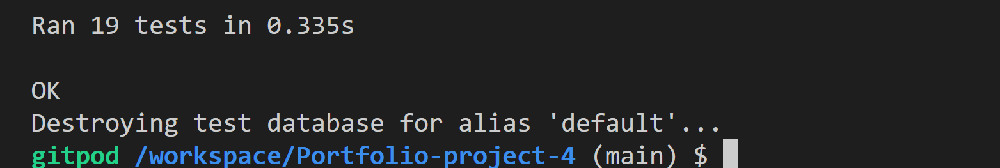
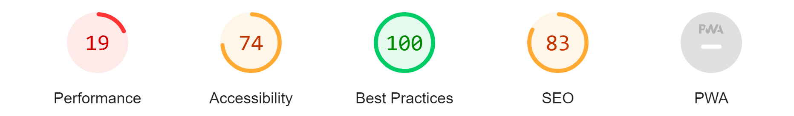

# Testing Documentation

In the development phase, ensuring the reliability, performance, and efficiency of the application is paramount. This document provides detailed insights into the various testing methodologies employed throughout the project. 

## Validator Testing

Using validators is an essential step in the development workflow. They provide an automated method to ensure that written code conforms to established web standards. Adhering to these standards ensures better compatibility, performance, and reliability of the website across various platforms and browsers.

### **Validation Results**:

1. **Django's in-built code**:
   - Using PEP 8 validators, the native code within Django's settings file was flagged for five line length errors. It's a common issue where lines exceed the recommended 79 characters for readability.
   
2. **Bootstrap's CSS**:
   - During the CSS validation, Bootstrap contributed 260 warnings. This is a known aspect of using Bootstrap, owing to its exhaustive nature and the breadth of properties it covers, many of which might not be used but are included for comprehensiveness.
   
3. **Fontawesome CDN**:
   - HTML validation indicated that the Fontawesome CDN was responsible for 6 errors. These are attributed to CSS variables present in the CDN's CSS, which some validators might not recognize or consider as non-standard.

> **Note**: When integrating third-party libraries, it's vital to recognize that they might not always align perfectly with every validation tool. However, their widespread use and acceptance in the developer community attest to their reliability and efficiency.

In addition to the above tools, I also employed the CodeInstitute's PEP8 validator ([PEP8 Validator](https://pep8ci.herokuapp.com/)). The validator rigorously checked the entirety of the codebase, reassuringly returning no errors. It's a testament to the quality and standards adhered to during the development process.

## Automated Testing

Automated tests are invaluable, especially in extensive projects. They ensure code changes don't introduce new bugs and that the application's main features function as intended.

### Models Testing

Three primary models were put under rigorous testing:

1. **Recipe Model**: This model, pivotal to the application's primary functionality, underwent tests for data integrity, relations, and CRUD operations.
2. **Ingredient Model**: Tests for this model verified proper linking with the Recipe Model and data validation.
3. **Comment Model**: Ensuring user comments are associated correctly with respective recipes and handle CRUD operations efficiently was the focus here.

### Views Testing

Views form the application's backbone. Their seamless functioning guarantees a good user experience. The following views were thoroughly tested:

1. **RecipeListView**: Verified proper fetching and displaying of recipes.
2. **RecipeDetailView**: Ensured a detailed view of each recipe, including its ingredients and associated comments.
3. **RecipeLikeView**: Assessed user interactions for liking recipes.

### URLs Testing

URLs connect views and templates. Tests here were centered on proper URL resolution for each view, ensuring smooth navigation without any dead links or errors.

### Testing Execution

To execute the extensive automated tests:

1. Clone the repository.
2. The project's settings connect to the designated database if a database URL is available in the config variables.
3. **Important**: Exclude the database URL in the config variables for testing. Django then utilizes a SQLite3 test database, safeguarding your primary PostgreSQL database.

The image below shows the results of the automated tests:

## Lighthouse Testing

For a visual summary, refer to the image below:

For a thorough understanding and detailed insights, you can access the [full Lighthouse PDF report](static/Images/Lighthouse%20Report.pdf).

## Lighthouse Testing - Deep Dive Analysis

### **Performance (22/100)**

When it comes to website performance, the factors contributing to the score of 22 are multi-faceted. One glaring issue is the time taken for content paints. The First Contentful Paint, which measures when the first text or image is painted, was registered at 10.6 seconds. This is a significant delay, especially for a web user awaiting the first visual response from the site. Even more alarming is the Largest Contentful Paint time, which indicates when the largest content element becomes visible. At 80.8 seconds, this is an area that requires immediate attention.

The primary culprits for these delays are:
- Oversized images, which, if properly sized, could save an estimated 68.55 seconds.
- The initial server response time also added almost 7 seconds to the load time.
- Render-blocking resources and the absence of next-gen image formats compounded the issues, adding unnecessary seconds to the loading experience.

Diagnostics provide further insights, highlighting an extensive network payload size and a range of issues from inefficient cache policies to long tasks that burden the main thread. Large layout shifts, which result in jarring visual changes, were evident from the reported Cumulative Layout Shift score of 0.543, potentially compromising the user experience.

### **Accessibility (74/100)**

While the score of 74 for accessibility is commendable, there are areas of improvement. Certain image elements were missing `alt` attributes, which are vital for screen readers and overall web accessibility. Some links lacked discernible names, which could hamper a user's navigational experience. Furthermore, contrast ratios between background and foreground colors were not optimal, which can impede readability for some users. Ensuring the HTML element has a `lang` attribute can also enhance the experience for international users.

### **Best Practices (100/100)**

The website shines in adhering to best practices, with a perfect score of 100. However, vigilance is required to ensure ongoing adherence to these standards, especially concerning areas like Content Security Policy (CSP) against potential XSS attacks.

### **SEO (83/100)**

For Search Engine Optimization (SEO), an 83 is a respectable score. However, to enhance discoverability, a few issues need addressing. The absence of a meta description could hinder the website's visibility in search engine results. Again, the missing `alt` attributes for image elements surfaced as a concern, impacting both accessibility and SEO.

### **PWA (Progressive Web App)**

In terms of PWA metrics, there are several issues preventing the site from being considered a full-fledged Progressive Web App. The absence of a web app manifest or properly configured service worker inhibits the site's installability. There's also an absence of a theme color for the address bar and a missing maskable icon in the manifest. These oversights, though technical, are crucial for enhancing mobile user experiences, particularly for those who might want to install the web app on their devices.

## Notable Bugs

During the development of the website, several notable bugs were encountered and resolved to ensure a smooth user experience. Here are some of the bugs that were identified, along with the details of the issues, their fixes, and the actions taken to prevent their recurrence.

1. **Recipe Image Display**:
   - **Issue**: An issue was discovered where images uploaded for recipes were not being displayed on the website. Investigation revealed that the problem was related to incorrect file paths in the media directory. This led to images failing to load as expected.
   - **Fix**: The root cause of the bug was traced to settings not correctly configured to handle media file serving. Adjustments were made to the settings file, specifying the correct media URL and root path. This ensured that images were displayed accurately.
   - **Prevention**: To prevent this issue in the future, a thorough review of media file settings will be conducted whenever images are added or modified. Regular testing of image upload functionality will also be part of the development process.

2. **Comment Deletion**:
   - **Issue**: A vulnerability was identified in the comment functionality, allowing users to delete comments not authored by them. This undermined the integrity of the comment section and posed a potential security concern.
   - **Fix**: Permissions for comment deletion were refined in the Comment View, ensuring that only the comment author or an admin could delete comments. This change restricted unauthorized deletion and maintained data integrity.
   - **Prevention**: Rigorous testing of comment functionality, including verifying permissions for user actions, will be carried out in the future. A security-focused mindset will guide the development process to prevent such vulnerabilities.

3. **Pagination Issue**:
   - **Issue**: During testing, it was observed that pagination for the RecipeListView was not functioning correctly. Instead of displaying a limited number of recipes per page, all recipes were displayed on a single page, leading to an unwieldy browsing experience.
   - **Fix**: The root cause of the pagination malfunction was identified as an error in the configuration of the paginator. The correct attributes and settings were applied to the paginator instance, restoring the intended pagination functionality.
   - **Prevention**: Future development efforts will include thorough testing of pagination components, ensuring that the correct number of items is displayed on each page. Regular testing of list views and pagination controls will be conducted to prevent similar issues.

4. **Search Bar Compatibility**:
   - **Issue**: Users reported that the search bar was not functioning as expected, failing to return relevant search results.
   - **Fix**: Investigation revealed that the search query processing was incomplete, leading to inaccurate results. The query logic was reviewed and modified to ensure accurate matching of search terms with recipe titles and descriptions.
   - **Prevention**: In the future, search functionality will be thoroughly tested using various search terms and scenarios. Continuous user testing will help identify any issues with search functionality and ensure that accurate results are returned.

5. **Inconsistent Styling on Mobile Devices**:
   - **Issue**: Users accessing the website on mobile devices noticed inconsistent styling and layout issues, affecting the overall user experience.
   - **Fix**: The issue was traced to incomplete media queries and CSS rules not optimized for mobile devices. Additional media queries were added, and CSS styles were adjusted to ensure consistent and responsive design across all screen sizes.
   - **Prevention**: Regular testing on various devices and screen sizes will be conducted during development to identify and address any styling inconsistencies. Mobile responsiveness will be a priority to deliver a seamless user experience on all devices.

These notable bugs, while posing challenges during development, have served as valuable learning opportunities. Each issue was systematically diagnosed, resolved, and followed by preventive measures. The experience gained from addressing these bugs will contribute to a more robust and reliable website in the future.

#### Technologies Used

The Recipie website incorporates a range of technologies that contribute to its functionality, user experience, and visual appeal. Each technology has been carefully selected to enhance various aspects of the application.

- **Python**: As the backbone language of the application, Python facilitates the development of various functionalities and business logic. It powers the backend operations, ensuring data processing, calculations, and other essential tasks are executed seamlessly.

- **Heroku**: Heroku, a Platform as a Service (PaaS) solution, plays a pivotal role in deploying the Recipie website. It provides an environment for hosting the application, allowing it to be accessible over the internet. While you've mentioned Heroku PostgreSQL as your primary database, it's worth noting that you're using ElephantSQL for your PostgreSQL database hosting.

- **Heroku PostgreSQL**: While you're using ElephantSQL for your PostgreSQL database, it serves as the primary relational database for both the development and production stages. PostgreSQL offers a robust and efficient way to store, manage, and retrieve data, ensuring data integrity and reliability.

- **JavaScript**: JavaScript adds interactivity and dynamic behavior to the Recipie website. By leveraging JavaScript, you've enabled features like form validation, real-time updates, and smooth transitions, enhancing the user experience and engagement.

- **Bootstrap 5.2**: Bootstrap is a versatile front-end framework that aids in creating responsive and modern design layouts. The application's user interface benefits from Bootstrap's grid system, components, and responsive utilities, ensuring consistent and appealing visuals across various devices and screen sizes.

- **Font Awesome**: Font Awesome is an extensive library that offers a diverse collection of icons. These icons are used throughout the Recipie website to enhance the user interface, provide visual cues, and contribute to the overall aesthetics of the application.

- **CSS**: Cascading Style Sheets (CSS) play a crucial role in enriching the design of the Recipie website. Custom CSS styles and themes have been crafted to ensure a unique and visually appealing experience for users. The use of CSS allows for precise control over the layout, colors, typography, and overall presentation of content.

- **HTML**: HyperText Markup Language (HTML) forms the foundational structure for the templates used in the Recipie website. HTML elements and tags define the content structure, headings, paragraphs, images, links, and other essential elements that make up the user interface.

Each technology used in the Recipie website contributes to its functionality, performance, and aesthetics. The combination of these technologies creates a seamless and engaging experience for users while providing a solid foundation for ongoing development and enhancements.

## Packages and Tools

The development of the Recipie website has been supported by a selection of essential packages and tools that streamline the development process, enable version control, and enhance the user interface.

- **Git Pod**: Git Pod serves as the Integrated Development Environment (IDE) that ensures a streamlined and efficient development environment. It provides a range of tools and features that contribute to code editing, debugging, and project management.

- **Git**: Git, a distributed version control system, is a vital component for maintaining code integrity and collaborating on projects. It allows tracking changes, managing branches, and facilitating collaborative development workflows.

- **GitHub**: GitHub acts as the platform for hosting the project repository. It offers version tracking, collaboration features, issue tracking, and pull request management, making it an essential tool for project management and code collaboration.

- **MockFlow**: MockFlow is an intuitive and user-friendly tool that plays a crucial role in the wireframing process. It allows you to create detailed and interactive wireframes that visually represent the layout and structure of the application's user interface.

### Requirements.txt

The `requirements.txt` file lists the Python packages and their corresponding versions required for the Recipie website's operation. These packages provide additional functionality, integrations, and utilities that enhance the application's capabilities. 
These packages contribute to various aspects of the Recipie website, including authentication, database management, form handling, deployment, and more. By specifying the packages and versions in the `requirements.txt` file, you ensure consistency and reproducibility in the development and deployment environments.

## Resources and Acknowledgments

Extensive resources were referenced during the development:

- Django documentation: A comprehensive guide to Django's functionalities.
- HTMX documentation: A detailed dive into HTMX's capabilities.
- Django AllAuth documentation: For authentication features.
- Code Institute materials: Tutorials and guides that assisted in various stages.

All resources were diligently cited to ensure proper acknowledgment.
